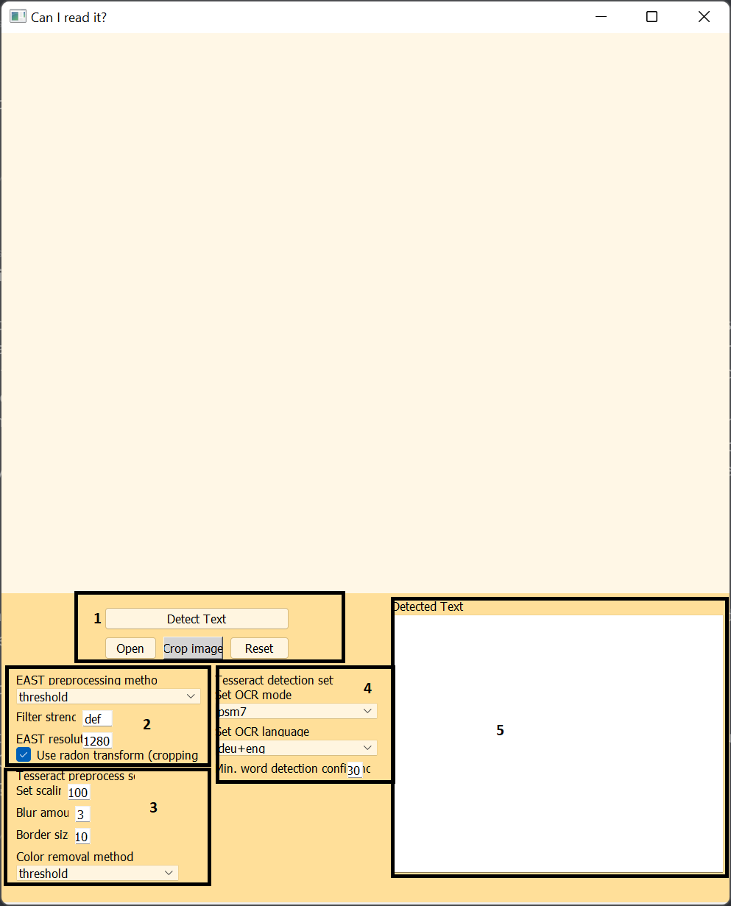

# Mediaprocessing 2021/2022 - Can I Read It? 
-----------------------------------------------------------------------------------------------------
# Installation instructions:
To execute the gui-version of our project (window.py) you have to install the following dependencies:

* Python3.8 or higher (https://www.python.org/downloads/)
* Tesseract-OCR (https://tesseract-ocr.github.io/tessdoc/Downloads.html)
* (optional) German language support for Tesseract (https://github.com/tesseract-ocr/tessdata/blob/main/deu.traineddata)
* PyQt5 (pip install PyQt5)
* OpenCV (pip install opencv-python)
* Numpy (pip install numpy)
* Matplotlib (pip install matplotlib)
* Python Imaging Library (pip install PIL-tools)
* Scikit image (pip install skimage)
* Python imutils (pip install imutils)
* Pytesseract (pip install pytesseract)

You might also have to install the micross font (provided in our github repository).

Please note that cropping images is not fully supported on macOS because they have removed
the support for sizegrips. We therefore recommend running this application under Linux or Windows.
------------------------------------------------------------------------------------------------------

# User Manual
You can start the gui-version with the command-line instruction ``` python window.py```, if this does not
work try ```python3 window.py```. Make sure the program is run from students_projects-can-i-read-it directory.

Upon startup the application will launch a small window headlined "Enter path to tesseract.exe", if you
are using a windows system you will have to provide the path to your tesseract installation, if you are
on a unix-based system and Tesseract is added to your path, you can just close this window by pressing
the cancel button. After the small window is closed, the main window becomes usable. 

Let us take a look at the main windows user interface:




* The purpose of the area in box 1 is to open and crop the image and to run the text detection
* The purpose of the area in box 2 is to allow the user to manually change the EAST preprocess settings
* The purpose of the area in box 3 is to allow the user to manually alter the Tesseract preprocessing
* The purpose of the area in box 4 is to allow the user to change the Tesseract operating mode and language 
* The area in box 5 will contain the detected text after running the analysis

We will now walk you through an exemplary user session of this application:

## Opening an image
To load a picture, you have to press the button labeled ```open```, this will open a file-dialogue where you 
can choose the picture.

## Cropping an image
After you have loaded the image you want to analyze you may want to crop the relevant section of the image.
To do so press the button labeled ```crop``` once, resize the crop area by dragging it's edges and move it using right click 
to a desired position in the image. If you now press ```crop``` again this will crop the selected region of the image.
If you are not satisfied with the cropped image you can always return to the original image by pressing the
```reset``` button.

## Run the analysis
After loading the image (and optionally cropping it) you can run the text detection by pressing ```Detect Text```.

## Adjust EAST settings
By using the dropdown menu in area 2 you can choose the preprocessing method for the EAST textbox detection. 
The box labeled with "EAST resolution" allows you to change the resolution that the textbox detection
works with. A higher resolution can improve results but can also increase the runtime, also note that setting
the resolution to one higher thatn the resolution of the image will yield worse results. 
!!The values for the resolution have to be a multiple of 32 for the program to work.!!
If the checkbox use radon transform is checked the image will be deskewed before EAST operates. If you want to 
use deskewing and the image does contain details except for text, please crop the relevant part of the image to improve 
the stability of the deskewing.

## Adjust Tesseract preprocessing methods
By changing the values in box 3 you can change the preprocessing settings for Tesseract.  The box labeled "Set scaling"
allow you to use the percentage in which the images are scaled, the box labeled "Blur amount" allows you to set the kernel
size for the smoothing filter and the box labeled "border size" allows you to increase or decrease the size of the padding applied before using Tesseract. 
The dropdown menu labeled "color removal method" allows you to select a method for removing the color from the image for Tesseract usage.

## Change settings for Tesseract
By changing the value in the box labeled "Min. word detection confidence" you can change the confidence threshold for detecting
a word. By increasing this value you will decrease the chance of noise falsely being detected as a word but this can also reduce
the number of actual words that are detected.
The dropdown menus in box 4 allow you to change the page segmentation mode and the language libraries Tesseract
uses for text detection. To detect the German language correctly make sure you have installed the German language pack for Tesseract.

Page segmentation modes:
  1    Automatic page segmentation with OSD = Tesseract expects the entire image/ text block as input
  7    Treat the image as a single text line = Tesseract expects a single text line as input
  
  
  


